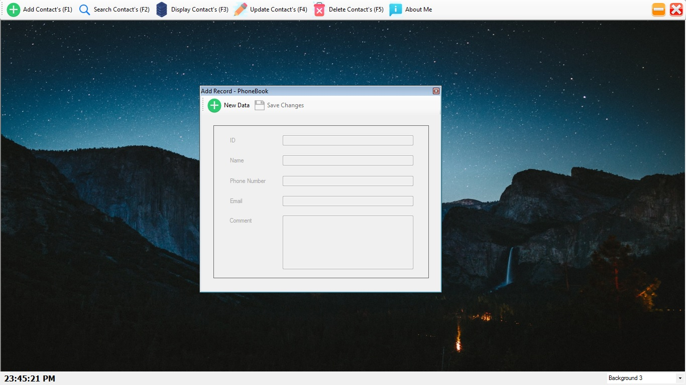
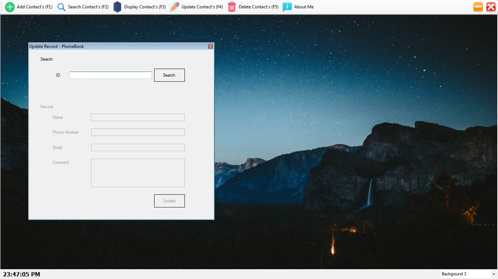

# CSharp-PhonebookProject

Simple phonebook application to make backup of your contacts (Fully based on CRUD Operations)

PREVIEW:-

Add Record - :heavy_check_mark:

Search Record - :heavy_check_mark:

View Record - :heavy_check_mark:

Update Record - :heavy_check_mark:

Delete Record - :heavy_check_mark:

TODO :-

- [ ] About - :soon:

and much more coming. :eyes:

:shipit:
